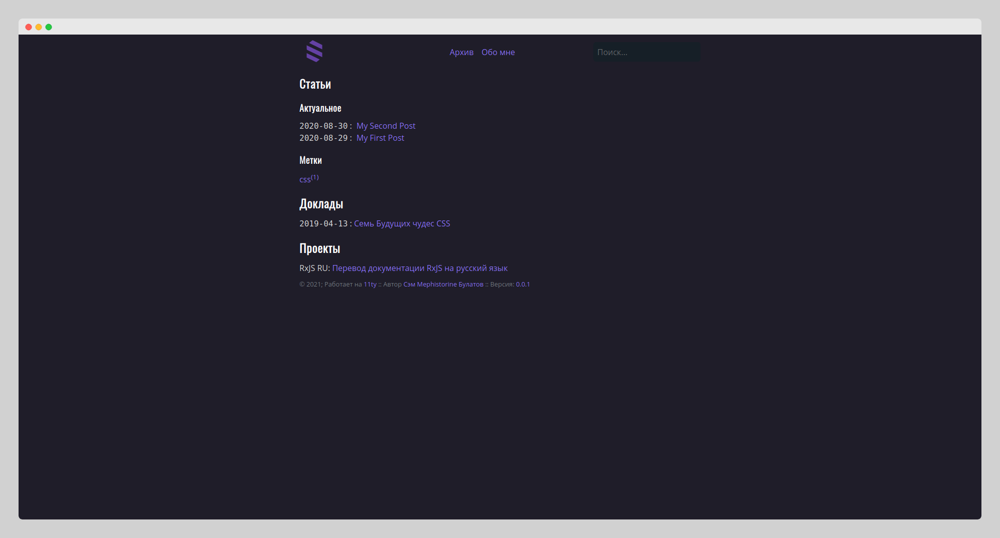

[](https://app.netlify.com/sites/dreamy-raman-57c050/deploys)

<p align="center">
  

<h2 align="center">YetAnotherBlog</h3>

  <p align="center">
    Еще один блог еще одного разработчика интерфейсов
    <br />
    <br />
    <a href="https://yetanotherblog.me">Главная страница</a>
    ·
    <a href="https://yetanotherblog.me/archive">Статьи</a>
  </p>
</p>

## О проекте



Статически генерируемый сайт с несколькими интерактивными элементами.

### Технологии

В разработке использовались следующие технологии:

- [Eleventy](https://www.11ty.dev)
- [RxJS](https://rxjs.dev/)
- [Typescript](https://www.typescriptlang.org/)
- [date-fns](https://date-fns.org)
- [markdown-it](https://github.com/markdown-it/markdown-it)

### Зависимости

* yarn
  ```sh
  npm install -g yarn
  ```

### Установка

```sh
yarn
```

### Запуск

```sh
yarn start
```

### Сборка

```sh
yarn build
```

## Лицензия

[MIT](LICENSE)

## Контакты

Имя: Сэм Булатов

- Email: mephistorine@gmail.com

- Telegram: [@mephistorine](https://t.me/mephistorine)

- Twitter: [@mephistorine](https://twitter.com/mephistorine)
